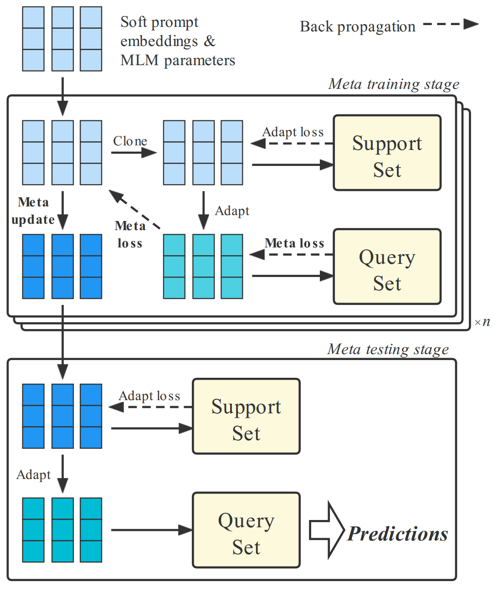

# MetaPrompting
Code and data for COLING 2022 long paper: 

*MetaPrompting: Learning to Learn Better Prompts*. Yutai Hou\*, Hongyuan Dong\*, Xinghao Wang, Bohan Li, Wanxiang Che
	
If you find this work useful and use it on your own research, please cite our paper.
	
```
@inproceedings{hou-etal-2022-metaprompting,
    title = "{M}eta{P}rompting: Learning to Learn Better Prompts",
    author = "Hou, Yutai  and
      Dong, Hongyuan  and
      Wang, Xinghao  and
      Li, Bohan  and
      Che, Wanxiang",
    booktitle = "Proceedings of the 29th International Conference on Computational Linguistics",
    year = "2022",
}
```
	
## Overview
Enabling models to learn from a few labeled examples, i.e., Few-Shot Learning (FSL), is one of the key steps toward more human-like artificial intelligence. We propose a novel prompting method MetaPrompting, which employs optimization-based meta-learning algorithm to find adaptive initialization for soft-prompt methods to aid few-shot text classification tasks. We optimize pretrained language model parameters as well as soft prompt parameters with MAML++ algorithm, which conducts tentative updates on support sets and optimize parameters with query set samples to find a more generalizable initialization point.

<p align="center">

</p>

## Data 
We ran experiments on 4 few-shot text classification datasets: HuffPost news headlines, Amazon product data, 20 newsgroup and Reuters. The processed data are filed in `data/`.

## Quickstart
Run MetaPrompting with default settings (Huffpost dataset, 5-way 5-shot) with bash scripts in `scripts/`.

```
bash scripts/MAML++.sh
```

## Code
- `MetaPrompting.py` is the entrance of MetaPrompting's training and testing procedure.
- `model.py` contains model definition, training and testing implementation.
- `dataloader.py` contains data processing code. 

## Revision
We corrected experiment results involving 20newgroup dataset influenced by a data construction error. MetaPrompting is reported to achieve 78.40 and 85.50 accuracy for 1 shot and 5 shot settings in the previous version, and these scores are corrected to be 79.63 (1 shot) and 83.90 (5 shot), still far exceeding SOTA baseline (71.84 and 81.85) and leading to consistent conclusions with the previous version. The new version of our paper is under processing, and will be publicly available on ACL Anthology and arXiv soon. 


